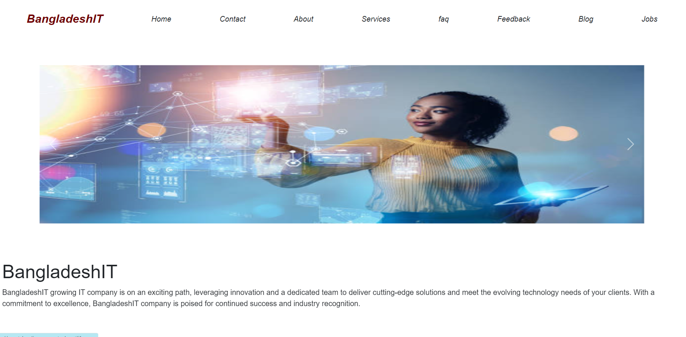

# BangladeshIT Website Documentation

Welcome to the documentation for the Bangladeshit website. This README provides an overview of the website and its 8 main sections, as well as information on the libraries used in its development.

## Libraries Used

The Bangladeshit website leverages several libraries to enhance its functionality and appearance. Here are the key libraries used:

- **Material-UI**: We use Material-UI to create a beautiful and responsive user interface. Material-UI provides a rich set of components and theming options for a modern web experience.

- **React Bootstrap**: React Bootstrap is utilized for additional UI components and styling. It complements Material-UI to ensure a cohesive design across the website.

- **AOS (Animate On Scroll) for Animation**: AOS is employed for smooth and eye-catching animations triggered on scroll. It adds a dynamic and engaging element to our website.

- **React Reveal for Animation**: React Reveal is integrated to create stunning animations and reveal effects that captivate the audience. It adds an extra layer of interactivity and excitement to the user experience.
---


# [Visit the live website](https://react-landing-page-task.netlify.app/)

## Sections

The Bangladeshit website is organized into 8 main sections. Each section serves a specific purpose or provides unique content. Below, you'll find a brief description of each section:

### Home



#### Here is a crausal,and bar chart to show the success for the it company.

### About


#### In this part there are history,mission and vision of this It company

### Services


### Feedback


### Blog


### Jobs


### Contact


### Faq's


To run this project on your local machine, you need to follow these steps:

### Prerequisites

Make sure you have the following software installed on your machine:

- [Node.js](https://nodejs.org/) (LTS version recommended)
- [npm](https://www.npmjs.com/) or [Yarn](https://yarnpkg.com/) package manager

### Installation

1. Clone this repository to your local machine:

   ```bash
   git clone https://github.com/shahriar021/React-Landing-page.git

   cd React-Landing-page

   npm install

   yarn install

   npm start
    # or
   yarn start


   The development server will compile the code and open the application in your default web browser. You can access the application at http://localhost:3000.
   ```

# [Visit the live website](https://react-landing-page-task.netlify.app/)

#### For responsiveness i have used media queries 

```
        @media screen and (max-width: 700px) {
    .about-us-main {
        margin: 0px 0px 0px 0px;
    }

    .about-img {
        width: 100%;
    }
    }

    @media screen and (max-width: 300px) {
    .about-us-main {
        margin: 0px 0px 0px 0px;
    }
    .about-img {
        width: 100%;
    }
    }

```
So for tablet 700px and mobile 300 or somewhere 360px.


